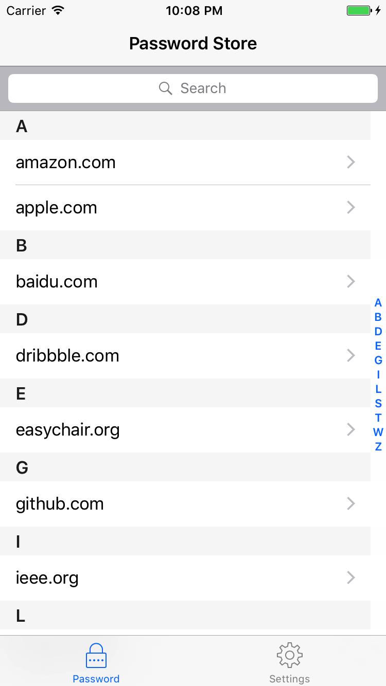
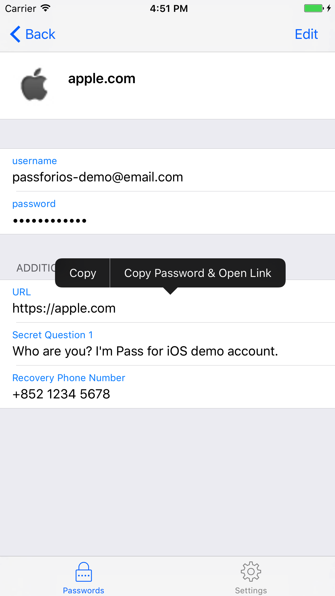
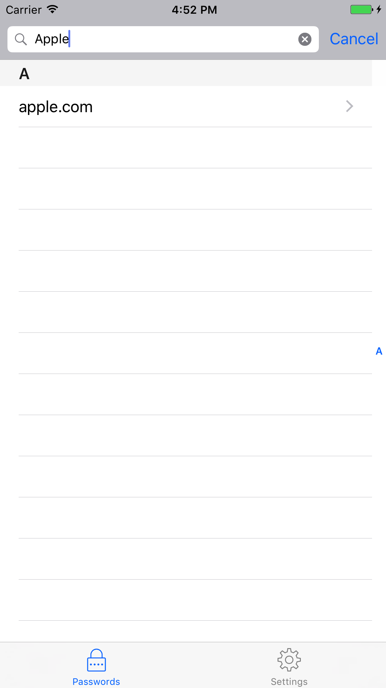

 

# Pass for iOS

`pass` is a password manager using GPG for encryption and Git for verstion
control. Pass for iOS is an iOS app using password management model of `pass`.

## Screenshots

## Usage

- genearte a PGP key pair
- use `pass`
- push password store to a private Git repository
- start to use Pass for iOS on your iPhone/iPad

For more, please read the [wiki page](https://github.com/mssun/pass-ios/wiki).

## License

MIT
