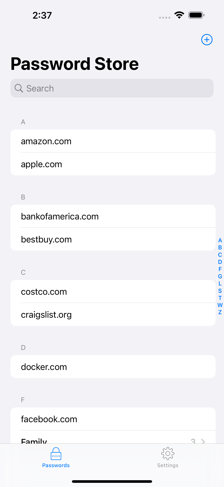
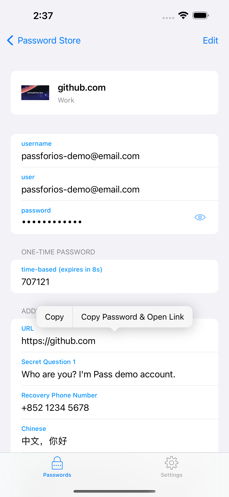
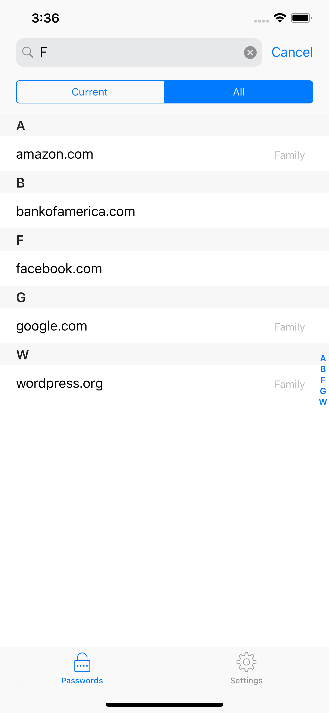

# Pass

Pass is an iOS client compatible with [ZX2C4's Pass command line application](http://www.passwordstore.org/).
It is a password manager using GPG for encryption and Git for version control.

Pass for iOS is available in the App Store with the name "Pass - Password Store".

If you want to join the iOS beta via TestFlight, drop an email to `developer@passforios.mssun.me`. Thank you.

## Features

- Try to be compatible with the Password Store command line tool
- View, copy, add, and edit password entries
- Encrypt and decrypt password entries by PGP keys
- Synchronize with your password Git repository
- User-friendly interface: search, long press to copy, copy and open link, etc.
- Support one-time password tokens (two-factor authentication codes)
- Autofill in Safari/Chrome and [supported apps](https://github.com/agilebits/onepassword-app-extension)
- Written in Swift
- No need to jailbreak your devices

## Screenshots

## Usages

- Setup your password-store ([official `Pass` introduction](https://www.passwordstore.org/))
- Get Pass for iOS from the App Store or [build by yourself](https://github.com/mssun/passforios/wiki/Building-Pass-for-iOS)
- Setup Pass for iOS ([quick-start guide](https://github.com/mssun/passforios/wiki#quick-start-guide-for-pass-for-ios))

For more, please read the [wiki page](https://github.com/mssun/pass-ios/wiki).

## Building Pass for iOS

1. Install libtool, automake, cmake, carthage, and go: `brew install libtool automake cmake carthage go`
2. Run carthage bootstrap in the project root directory: `carthage update ` then `carthage bootstrap --platform iOS` (this may take some time)
3. Run `./gopenpgp_build.sh` to build go dependencies.
4. Open `pass.xcodeproj` file in Xcode.
5. Build & Run.

## License

MIT
